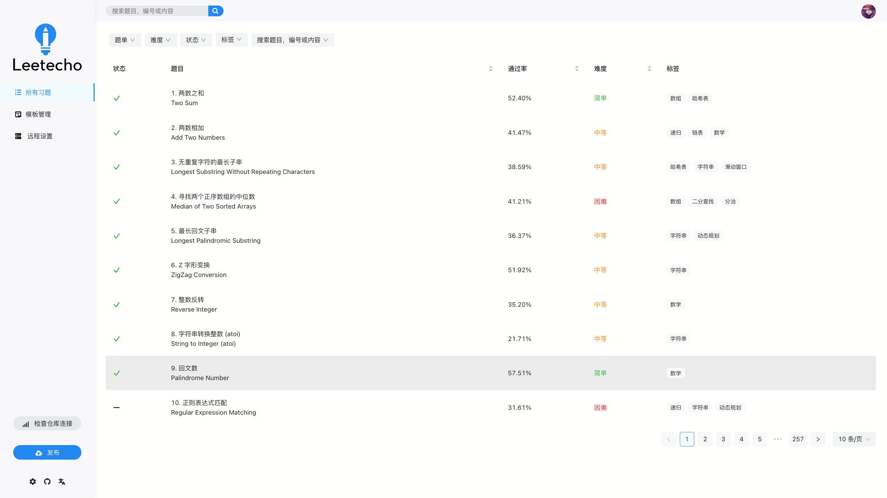
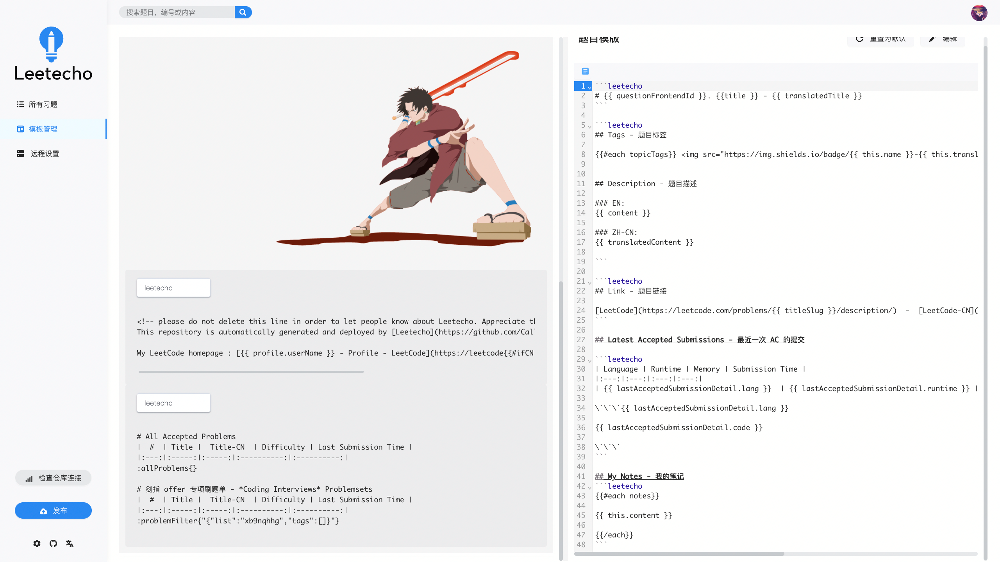
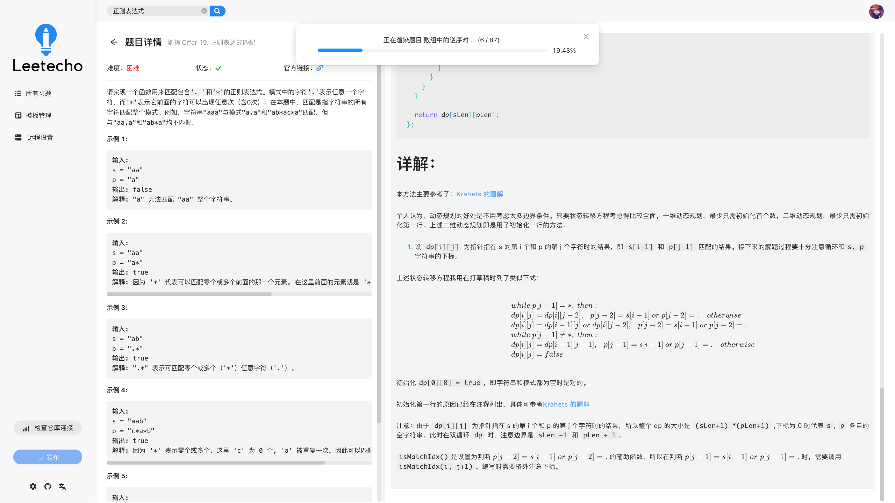
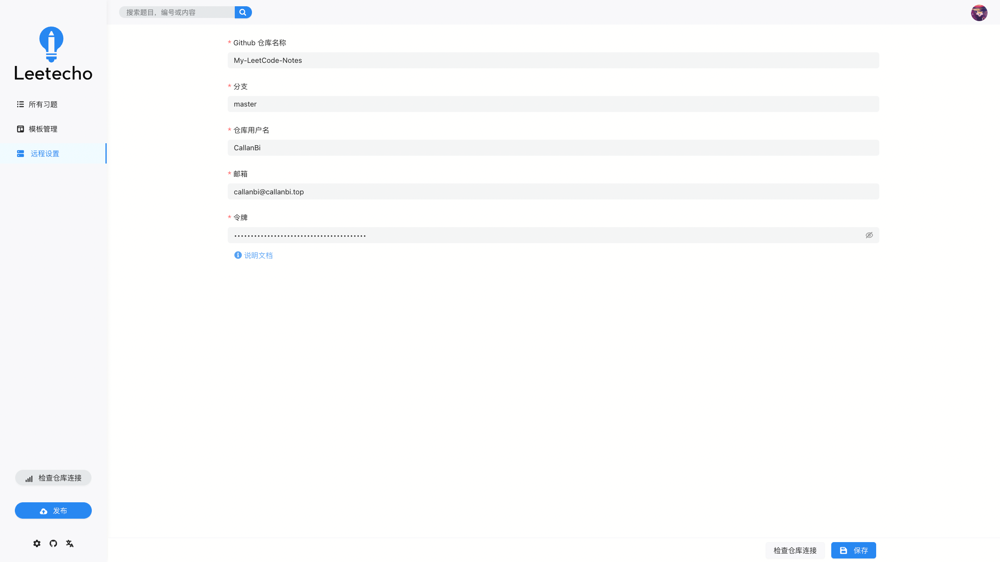

---

Leetecho is an elegant, experience-friendly product that automatically generates LeetCode solutions and notes and publishes them to personal repositories on code hosting platforms.

  [Download](https://github.com/CallanBi/Leetecho/releases) | [Products Landing HomePage](https://callanbi.top/Leetecho)

  <!--  -->

  

---
 [English](https://github.com/CallanBi/Leetecho/blob/main/README.md) | [简体中文](https://github.com/CallanBi/Leetecho/blob/main/README-zh.md)

**Only `leetcode-cn.com` accounts are currently supported;**
**The product only supports Simplify Chinese at the moment, supporting i18n construction and `leetcode.com` are on the schedule, stay tuned!**

Write custom cover and LeetCode question templates, upload your submissions and codes to your personal repository, and let your fabulous ideas and codes showcase in the open source world.

Here's the fun part: if you brush one question a day, Leetecho can keep your road map green all year long!

[Example of Generated Notes](https://github.com/CallanBi/My-LeetCode-Notes)

## Leetecho Explanation

- First four letters Leet: LeetCode.

- The last five letters Techo: The Japanese romanization of 手帐 (てちょう). てちょう has the meaning of Notebook, Handbook and so on.

- The last four letters of Echo: This product allows you to recall your thoughts and state of mind when solving problems.

## Features

1. Autogenerate: Automatically pulls information about topics that have been written in LeetCode, code you have submitted, and notes in your LeetCode Notebook.

2. Freely editable templates: The GUI has a built-in Markdown editor that allows you to fine-grained edit cover templates and question templates. Leetecho provides customized template syntax to do so.

3. Multiterminal: support Windows(x64), MacOS(arm64 & x64). (Theoretically Linux is also supported, but not yet tested)

4. Customized question sets: You can filter the questions by specific filters to form a question set. For example, You can freely select certain topics from the all of the questions to form a question set for showcasing.

5. A more user-friendly experience than the official LeetCode website, with a more convenient question search that quickly brings you back to the source of inspiration for writing the question.

Documentation, FAQs and iteration plans and more can be found on the [Product Landing home page](https://callanbi.top/Leetecho)(only in Simplify Chinese version currently).

## Product Interface

  
  

  
  

## Special Thanks

This project draws on, uses, or is inspired by the following projects, with special thanks to:

1. [jlice/leetcode-publisher](https://github.com/jlice/leetcode-publisher) provides the initial inspiration for this product;

2. [Saul-Mirone/milkdown](https://github.com/Saul-Mirone/milkdown/tree/main/packages/plugin-menu/src) provides Markdown editing capabilities；

3. [realVEct0r/leetcode-api](https://github.com/realVEct0r/leetcode-api) provides ideas for requesting LeetCode services.

## License
[MIT](https://github.com/CallanBi/Leetecho/blob/main/LICENSE). Copyright (c) 2021 CallanBi

